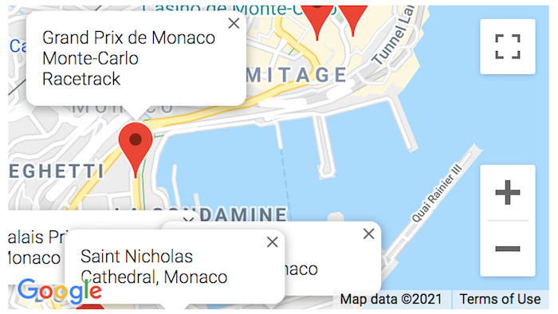
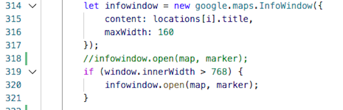
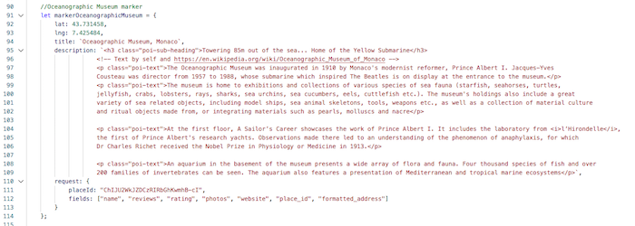
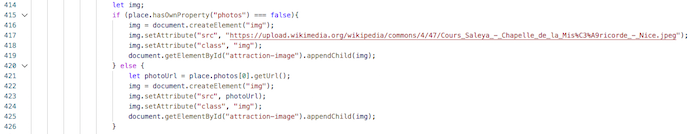
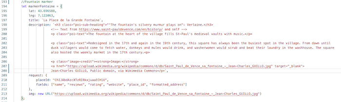
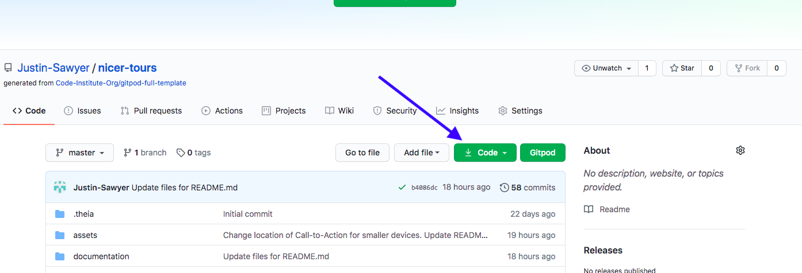

<h1 align="center"><a href="https://justin-sawyer.github.io/nicer-tours/index.html">Nicer Tours</a></h1>

This is the website for Nicer Tours, a new company offering sightseeing tours of the South of France.

Nicer Tours guarantee tour departures through their "Guaranteed Departure" tour option, the only tour company able to offer this.
Since tours have to be economically viable, many tours are cancelled during the off-season. Guaranteed departure allows the company to 
run a profitable organisation all year round.

However, the Guaranteed Departure option is not heavily promoted, because promoting a loss-leader is not a good business idea. Regular 
(Flexible Departures) are promoted as a means to allow the customer to believe they are getting the best possible deal, since they 
always pay the lowest price in this option. Equally, promoting Flexible Departure options allows the company to run with a maximum 
amount of customers for each tour.

## User Experience (UX)

- ### User stories:
    - #### First time visitors:
		1) As a first time visitor, I am either planning or am on my vacation in Nice, France and I want to visit a website that informs me about the most interesting sights and places I can visit while on this vacation.

        2) I want to have my interest aroused while I view the website, and thus choose to make a booking for a tour.

        3) As a first time visitor to the website and perhaps to the geographical area covered in the site, and being on vacation, I do not want to feel pressured into buying. However a little special offer may help me choose this company rather than another.

        4) I want to be able to navigate through the website easily, and be prompted where necessary to either contact the site creators (and service vendor) or make a booking easily if I choose to.

        5) As a first time visitor who is also on vacation, I want to be sure that I have made the right choice of tour company, so customer reviews and social comments about the company are very important.

    - #### Returning visitors:

        1) As a returning visitor, I want to be able to add my story to the many reviews I have seen on the website.

        2) As I will be returning to the site almost definitely after having taken a tour, I want to both be reminded of the fun I had, and also be able to inform others about the service offered by the company. Thus, good navigation and design are important, but so is the general informative nature of the services and sights offered on the site.

    - #### Frequent visitors:

        1) As a frequent visitor, I will probably be a professional in the tourist industry, since most people visit specific areas on vacation once only.

- ### Design:
    - #### Colour scheme:
        The project uses three main colours, all emblematic of the city of Nice. These three colours are the Yves Klein International Blue, contrasted with orange, and a pure white.

        1) Nice - main city of the *Côte d'Azur* which in itself means Blue Coast - is famous for its blue skies and blue sea. The Yves Klein International Blue (rgb 0,47,167) was created by the artist Yves Klein, himself born in Nice.

        2) Orange reminds the viewer of the Mediterranean sun, and is also the opposite of blue on colour wheels.

        3) A pure, simple white background was chosen as white represents light, another quality for which Nice and the surrounding area 
        is famous.

    - #### Typography:

        Again, two distinct font styles have been used, but each compliments the other.

        1) Titles, headings and other "special use cases" (for example, the Call To Action banner) use the Poiret One font. This font was chosen as it represents the *Belle Epoque* era of the 1920s and 30s, a time when the *Côte d'Azur* and Nice itself were
amongst the most fashionable of destinations.

        2) The Open Sans font was chosen as the typeset for the main body of the website. Although Poiret One is an extremely elegant font, it would have been overkill to use this font uniquely. Thus, the equally elegant Open Sans font was chosen to compliment Poiret One.

        Both fonts use Sans Serif as a fallback if for in any case the chosen fonts do not render.

    - #### Imagery:

        The website is designed to entice the user to either take a tour, to dream of their upcoming vacation or to tempt first time users to choose Nice and the *Côte d'Azur* for their next vacation destination. It is for this reason that wide panoramic photos have been used for the banners to each page, while scrolling images (carousels) have been used as a further navigational aid on the home page.

- ### Wireframes:
    [Home page for Desktop](https://justin-sawyer.github.io/nicer-tours/documentation/wireframe/desktop-home.png)

    [Tours for Desktop](https://justin-sawyer.github.io/nicer-tours/documentation/wireframe/desktop-tours.png)

    [Book Now for Desktop](https://justin-sawyer.github.io/nicer-tours/documentation/wireframe/desktop-book-now.png)

    [Home page for Mobile](https://justin-sawyer.github.io/nicer-tours/documentation/wireframe/mobile-home.png)

    [Tours for Mobile](https://justin-sawyer.github.io/nicer-tours/documentation/wireframe/mobile-tours.png)

    [Book Now for Mobile](https://justin-sawyer.github.io/nicer-tours/documentation/wireframe/mobile-book-now.png)

## Features:
-	This website is fully responsive.

-	It includes certain interactive elements, such as modals and popovers.

-	Although the project is not being marked on the inclusion of JavaScript elements, I have chosen to include one in the inclusion of the Call To Action popover. I included it for the challenge of making it work.

## Technologies Used:
- ### Languages:
	[HTML5](https://en.wikipedia.org/wiki/HTML5)

	[CSS](https://en.wikipedia.org/wiki/CSS)

	[JavaScript](https://en.wikipedia.org/wiki/JavaScript)

- ### Frameworks, Libraries & Programs:

	[Bootstrap v4.5.2](https://getbootstrap.com/) forms the vast majority of the "formatting code" (the grid system, containers, button elements etc.) of this website. It was used because of its responsiveness and because it is compatible with so many browsers. While the underlying code may be from Bootstrap, I have in places heavily modified it (or tried to!). A good example of this is the Navigation bar. The colours used, the position of the site name and the colour of the "burger" icon. Credit for additional code used within is given in the HTML files themselves.

	[Google Fonts](https://fonts.google.com/) were used to import the different fonts (Poiret One and Open Sans) used on this website.

	[Font Awesome v4.7.0](https://fontawesome.com/v4.7.0/) was used for the social icons seen in the footer of each page.

	[Popper.js](https://popper.js.org/) was used for the little piece of JavaScript in this project: the positioning of the popover in the Call To Action.

	[Git](https://git-scm.com) was used for version control.

	[GitPod](https://www.gitpod.io/) was used as the writing tool. 

	[GitHub](https://www.gitpod.io/) was used as the repository for the files within this project.

	[Preview for Mac](https://support.apple.com/en-gb/guide/preview/welcome/mac) was used for image sizing (both in terms of height and width, and weight of file).

	[Balsamiq](https://balsamiq.com) was used for the creation of the wireframes.

    [Compress PNG](https://compresspng.com/) was used for compressing images in the User Stories section of this README.md file.

## Testing

This website was tested using the following tools:

1. [W3C HTML](https://validator.w3.org/) was used to verify the HTML code:
	* [Index.html](https://justin-sawyer.github.io/Nicer-Tours-MS2-with-Maps-Integration//documentation/code-verification-ms2/html-verified/validator.w3.org-index-html.png)	
	* [tour-of-nice.html](https://justin-sawyer.github.io/Nicer-Tours-MS2-with-Maps-Integration//documentation/code-verification-ms2/html-verified/validator.w3.org-tour-of-nice-html.png)
	* [tour-of-monaco.html](https://justin-sawyer.github.io/Nicer-Tours-MS2-with-Maps-Integration//documentation/code-verification-ms2/html-verified/validator.w3.org-tour-of-monaco-html.png)
	* [tour-of-st-paul-de-vence.html](https://justin-sawyer.github.io/Nicer-Tours-MS2-with-Maps-Integration//documentation/code-verification-ms2/html-verified/validator.w3.org-tour-of-st-paul-de-vence-html.png)
	* [personal-tour.html](https://justin-sawyer.github.io/Nicer-Tours-MS2-with-Maps-Integration//documentation/code-verification-ms2/html-verified/validator.w3.org-personal-tour-html.png)
	* [book-now.html](https://justin-sawyer.github.io/Nicer-Tours-MS2-with-Maps-Integration//documentation/code-verification-ms2/html-verified/validator.w3.org-book-now-html.png)
	* [payment.html](https://justin-sawyer.github.io/Nicer-Tours-MS2-with-Maps-Integration//documentation/code-verification-ms2/html-verified/validator.w3.org-pyment-html.png)

2. [W3C CSS](https://jigsaw.w3.org/css-validator/) was used to ensure there were no CSS code errors in this project:
	* [CSS](https://justin-sawyer.github.io/Nicer-Tours-MS2-with-Maps-Integration//documentation/code-verification-ms2/css-verified/jigsaw.w3.org_css-validator-Nicer-Tours-CSS.png)

3. [JSHint](https://jshint.com/) was used for the verifaction of the JavaScript:
	* [tour-of-nice.js](https://justin-sawyer.github.io/Nicer-Tours-MS2-with-Maps-Integration//documentation/code-verification-ms2/javascript-verified/jshint.com-tour-of-nice-js.png)
	* [tour-of-monaco.js](https://justin-sawyer.github.io/Nicer-Tours-MS2-with-Maps-Integration//documentation/code-verification-ms2/javascript-verified/jshint.com-tour-of-monaco-js.png)
	* [tour-of-st-paul.js](https://justin-sawyer.github.io/Nicer-Tours-MS2-with-Maps-Integration//documentation/code-verification-ms2/javascript-verified/jshint.com-tour-of-st-paul-js.png)
	* [personal-tour.js](https://justin-sawyer.github.io/Nicer-Tours-MS2-with-Maps-Integration//documentation/code-verification-ms2/javascript-verified/jshint.com-personal-tour-js.png)
	* [sendEmail.js](https://justin-sawyer.github.io/Nicer-Tours-MS2-with-Maps-Integration//documentation/code-verification-ms2/javascript-verified/jshint.com-sendEmail-js.png)
	* [payment.js](https://justin-sawyer.github.io/Nicer-Tours-MS2-with-Maps-Integration//documentation/code-verification-ms2/javascript-verified/jshint.com-payment-js.png)
	* [make-payment.js](https://justin-sawyer.github.io/Nicer-Tours-MS2-with-Maps-Integration//documentation/code-verification-ms2/javascript-verified/jshint.com-make-payment-js.png)

4. Google Chrome's Dev Tool was used extensively while writing this website. The JavaScript was tested almost line by line, whether that be in Console (to check for general errors), in Applications (to check for errors in sessionStorage) or Sources (to find the reason(s) pieces of code were not working).

5. The [Lighthouse plugin for Google Chrome](https://chrome.google.com/webstore/detail/lighthouse/blipmdconlkpinefehnmjammfjpmpbjk?hl) was used for speed checking and "tweaking" setting for maximal optimisation for web deployment.
	* [index.html](https://justin-sawyer.github.io/Nicer-Tours-MS2-with-Maps-Integration/documentation/code-verification-ms2/lighthouse/justin-sawyer.github.io_2021-01-28_index.html)
	* [tour-of-nice.html](https://justin-sawyer.github.io/Nicer-Tours-MS2-with-Maps-Integration/documentation/code-verification-ms2/lighthouse/justin-sawyer.github.io_2021-01-28_tour-of-nice.html)
	* [tour-of-monaco.html](https://justin-sawyer.github.io/Nicer-Tours-MS2-with-Maps-Integration/documentation/code-verification-ms2/lighthouse/justin-sawyer.github.io_2021-01-28_tour-of-monaco.html)
	* [tour-of-st-paul-de-vence.html](https://justin-sawyer.github.io/Nicer-Tours-MS2-with-Maps-Integration/documentation/code-verification-ms2/lighthouse/justin-sawyer.github.io_2021-01-28_tour-of-st-paul-de-vence.html)
	* [personal-tour.html](https://justin-sawyer.github.io/Nicer-Tours-MS2-with-Maps-Integration/documentation/code-verification-ms2/lighthouse/justin-sawyer.github.io_2021-01-28_personal-tour.html)
	* [book-now.html](https://justin-sawyer.github.io/Nicer-Tours-MS2-with-Maps-Integration/documentation/code-verification-ms2/lighthouse/justin-sawyer.github.io_2021-01-28_book-your-tour.html)
	* [payment.html](https://justin-sawyer.github.io/Nicer-Tours-MS2-with-Maps-Integration/documentation/code-verification-ms2/lighthouse/justin-sawyer.github.io_2021-01-28_payment.html)

## Public Testing

## Code Testing
This project has been a labour of love, and has taken many, many hours to complete. Code was tested exhaustively to check for errors and bugs:

### Google Maps JavaScript code, Tours of Nice, Monaco and St-Paul de Vence:

The Google Maps code itself has been taken from the [Google Maps API](https://developers.google.com/maps/documentation/javascript/overview) but has been heavily modified to suit the needs of this website:

#### Markers and Infowindows:

The original idea for this site was to have Infowindows for each Point of interest on all screen sizes, whether mobile, tablet, or desktop. However, it soon became clear that no matter how the map was zoomed upon first displaying online, this was not a practical solution for mobile screens: the Points of Interest being often very near to each other meant that the Infowindow was more often than not blocking other markers and/or Infowindows. A prime example of this can be seen below:

One solution for this was to have markers only for screen sizes of landscape view on tablets and higher. Thus, the original code from Google Maps API was changed from

to

However, this still only solved half of the problem. The standard size of Google Maps has a landscape styled viewport, while many of the Places of Interest featured on Nicer Tours tours were more on a North-South axis. Thus the decision was taken to vary the size of the map height both depending on the screen size and of the Points of Interest being highlighted. Thus, outside of the Google Maps API code, jQuery was added. The jQuery was not added for a general map view, but for each section of the tour in question: Thus clicking on a certain button on the tour page will bring the map into view - that is, change its status from hidden to visible, adjust its size and orientation, adjust its centre point to make the markers (and/or Infowindows) appear in the most centralised position possible for each screen size, and make sure that each map is displayed within the viewer's screen - that is, once the viewer clicks the button, the page scrolls to the top of the buttons (keeping them visible on the screen) rather than having the map appear outside of the viewing scope of the device. The image below highlights this:

It was decided to keep the CSS inline rather than creating classes and using the .addClass() command to ensure that the maps did not fall back to a default size. It was also decided that for each map view not to set a default map.setZoom() level if the map being viewed called for it, but rather have each screen size stating the map view for the same reason. 

Whilst setting the map zoom levels and viewing the results using GitPods screen viewer, it was noticed that the central part of the map did not always centralise the markers for each zoom level. Thus, again, we can see in the image above that the map.setCenter() zoom levels have been adjusted for the best viewing experience for each screen size and orientation.

Although the result will never be perfect - some Places of Interest are almost "next-door nieghbours" to each other - a good example of the viewing experience can be seen in this finished example, taken from the [Tour of St. Paul de Vence) page, from the white "St Paul de Vence" button:

#### Markers and viewports:

The original idea for these pages was to have Infowindows with a link attached to them. Upon clicking these links, the user would be taken to an information window detailing a description of the place in question, with photos and reviews taken from the Google Maps API:

However, it was found that the behaviour of the infowindow was inconsistent. If the link directs to an outside source (using the target"_blank" method in the HTML, the behaviour was always as expected. However, directing a link to an element id within the same page HTML, did not always work as expected. At times, the window being brought into view would not be brought to the top of the scroll position. Also, with the markers themselves acting as onclick events, it was decided that having links in the infowindows was overkill, and also contributed to the general "clutter" of the map being viewed. Thus, this idea was dropped.

#### On Click Events with Markers:

As can be seen in the online version of this website, clicking a marker on a map in these "general tour" pages descends the viewpoint to a photo, description, and certain buttons - Reviews, Find Out More, and Back To Map. However, the [Google Places API](https://developers.google.com/maps/documentation/javascript/places) is not a perfect source: 

Some places are listed twice as can be seen here:

Others may not have reviews or photos associated with them. Prime examples of this are city squares. Google Maps and Places highlight primarily businesses and POINTS of interest rather than streets or geographic locations. And of course, streets and squares do not have websites associated with them!

Further, it was discovered that almost all places in the Google Places API are lacking a decent description.

These were dealt with in the following ways:

Each marker, as they are custom markers, has had key/value attributes added to them, as can be seen below:

As can be seen above, the markers have lat/lng keys for their map position, as well as a title, description, and a request key to obtain information from the Google Places API.

##### Places lacking desciptions:
Since the vast majority of places in the Places API were lacking descriptions, the developer was faced with a choice: either get this information from a different API or write their own description, with information being taken from different sources. The developer looked at many different APIs - TripAdvisor, Booking, Yelp to name just a few of them. However, the descriptions offered were more review descriptions along the lines of "Nice place, I'd visit it again" rather than descriptions detailing the place itself. Thus the developer looked to the [wikipedia.com API](https://www.mediawiki.org/wiki/API:Main_page) for a solution. However, the developer found that he could almost always get a good description of the Place of Interest in question, but that the description was not always in English. For example, while the main cathedral in Nice has an entry in the French wikipedia, it does not have one in the English version. For viewers lacking an auto-translate on their device, this would not be ideal. Thus, the decision was taken to write a description, often taken from several sources and adapted, with each of those sources being credited in the code, as can be seen on line 96 of the above image.

##### Places lacking images: 
Within the main Google Maps JavaScript is the follosing code to retrieve image from their JSON listings:

For those listings without images, one of two solutions was used: either to get a specific image URL or to add an extra key/value to the marker in question. Thus, for example, if the page being viewed was lacking an image for one specific location, the following code was used, with the original block of code housed inside the else statement:

While if a "general tour" page had more than one place lacking an image in the Places API, the following block of code was written, again with the original code housed in the else statement:

Where this second solution was used, the extra key/value can be seen below:

Where either of these solutions has been used, the source of the image is credited within the code and is viewable on the user's device in small print within the description.

##### Places lacking websites:
Again, as above, it is almost always the case that a street, a square, or a village does not have a listing in the Google Places API. Thus gain the developer was left with a choice: either write code that sent the viewer to a search engine and allow the viewers to research the place themselves, or to state on the page that the place listed does not have a website.

It was decided that the latter of these options was the best idea, as feedback indicated that going having a "Find Out More" button for that listing implied that there is a website. It was felt by the developer also that the point of the website is to keep viewers on this website rather than possibly have the viewer lose interest when being directed elsewhere. Thus, where the Place of Interest does not have a website, the JSON request in the marker's key/values should not include a search for a website, and that the button in the HTML code (within the JavaScript code) should be replaced with a different element. 

An example of the JSON request for a location without website:

The code within the Google Maps funcion:

Since there is a distinct possibility that certain places contained in Nicer Tours currently without websites may indeed have a website in the near future - the city of Nice has applied for a UNESCO World Heritage Listing for the Promenade des Anglais, for example - it was decided to simply change the button element to a paragraph element without altering the classes within the element, for ease of to develpment when these places do eventually get their websites. However, the key/value within the JSON request was removed to guard against any spurious listing that might appear in the Google Places API.

## Lighthouse Results
Many of the results seen in the Lighthouse files are due to elements outside of this website:

1.	Render Blocking Resources:
Having read the report, I used both "defer" and "async" methods within the tags as suggested. Neither method improved page load time discernably, and both methods partly broke the rendering of the page online (example: the links in the navigation bar beneath the banner image no longer changed colour as they should when moused over). Because of this, the website uses neither method to stop render blocking.
2. Font Rendering:
The suggested fixes within the Lighthouse documentation are for inline files or scripts. This website uses a Google Font that is loaded within the CSS using the "@import url("") methods, for which there is no fix available.

3. Contrast Ratio for certain elements:
As previously mentioned, these colours were chosen as they are opposites on the colour spectrum. The call-to-action banner actually changes colour subtly. It is possibly this that is causing the Contract Ration to be called into question.

4. Links without discernable names:
Links in question are Font Awesome icons

5. Browser error logged to Console:
This browser error is due to sessionStorage being empty until it is filled from entries in the input elements on the [Book Now](https://8000-dabd8e84-22f4-49e8-973f-a1efde410b00.ws-eu03.gitpod.io/book-your-tour.html) page.

## Deployment
- ### GitHub
	This site was published to GitHub and deployed as a live site via the following steps:

	1) Log in to GitHub and locate the [repository](https://github.com/Justin-Sawyer/nicer-tours).

	2) Click "Settings" in the menu just above the file listings:

	

	3) Scroll down to GitHub Pages and select "Master Branch" from the Source list:

	

	4) The page will refresh. Scroll down again to GitHub Pages and select the now live [link](https://justin-sawyer.github.io/nicer-tours/index.html):

	

- ### Forking the GitHub repository
	Making a fork is like making a duplicate, from which one can edit the repository without affecting the original.

	1) Log in to GitHub and locate the [repository](https://github.com/Justin-Sawyer/nicer-tours).

	2) Click "Fork":

	

	3) A fork should now have been created in your GitHub account.

- ### Making a local clone
	You can clone and deploy this in your GitHub Desktop application by following these steps:

	1) Log in to GitHub and locate the [repository](https://github.com/Justin-Sawyer/nicer-tours).

	2) Click the green "Code" button:

	

	3) Either click "Open with GitHub Desktop" and follow the prompts in the GitHub Desktop application, or alternatively follow the instructions 
from [this link](https://docs.github.com/en/github/creating-cloning-and-archiving-repositories/cloning-a-repository#cloning-a-repository-to-github-desktop),
depending on your Operating System.

## Credits
- ### Code
	- [Bootstrap v4.5.2](https://getbootstrap.com/) was used extensively throughout this project for its responsive properties. Many elements were taken from the Bootstrap library, such as Carousels and Accordians, but each element has been heavily modified for the needs of this website.

	- [W3Schools.com](https://www.w3schools.com/) was used extensively for research for this project.

	- [Stack Overflow](https://stackoverflow.com/) has been a fountain of knowledge in the production of this project.

	- Where other 'non-original' code has been used, it has been credited within the html and css files.

- ### Media

	- Unless otherwise stated, all images are my own. Some may appear on [this website](https://www.sunnydaysnice.com). The website owners are my former employers, and used my photos for their website. You can confirm this by email: welcome@sunnydays.fr

- ### Content

	- All content written by the developer.

## Acknowledgements

[Code Institute](https://codeinstitute.net/) for the tuition, and the mentor I have been assigned.

[This little fellow](https://www.sciencephoto.com/media/1008843/view/colorectal-cancer-cell-sem) for making me see sense.

GG for the constant presence and encouragement. You are a pearl.

My former employer, The Travel Expert, in the tourism industry. Without them, I would not have been in a position to make such a 
detailed project.

My family for the encouragement and help in seeing this project become a reality.

## Future plans

As the company grows, the website will grow alongside. This will involve adding extra tour destination pages, sub-sections as mentioned above, 
and a full reviews page with a gallery of photos taken by customers.
